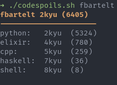
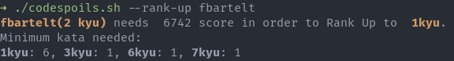
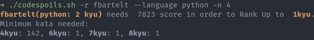
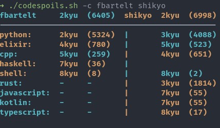
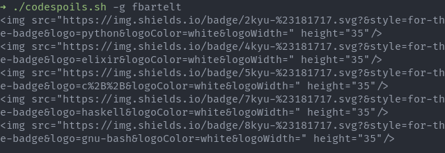
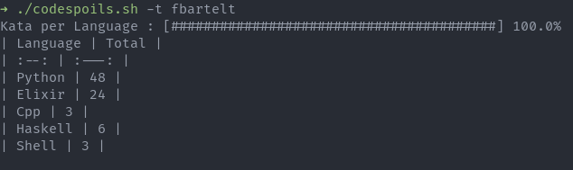
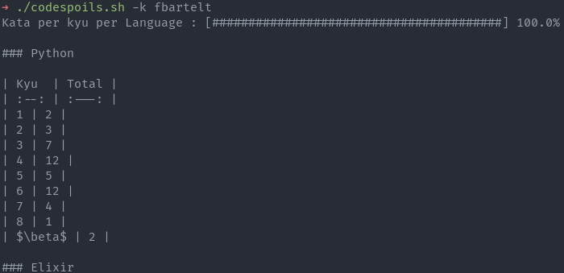
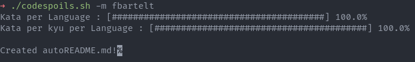
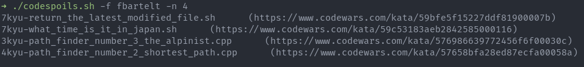
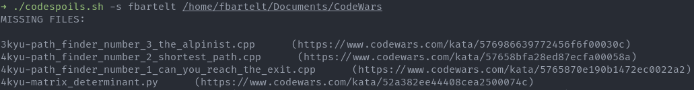

# CodeSpoils

CodeSpoils is a bash script that helps manage your CodeWars solutions repository and interact with the CodeWars API. With CodeSpoils, you can easily view your overall and language rank, compare your progress with friends, and track the minimum number of kata you need to solve in order to rank up. Additionally, CodeSpoils can auto-generate file names for your last solved kata, help you find any missing files for completed katas and auto-generate a README for your CodeWars solutions repository. This script was created to streamline your CodeWars experience and make it easier to track your progress and achievements.

<details>
<summary><big>Table of Contents</big></summary>

- [Features](#features)
- [Disclaimer](#disclaimer)
- [Requirements](#requirements)
- [Installation](#installation)
- [Usage](#usage)
  - [Operations](#operations)
  - [Options](#options)
- [Examples](#examples)
- [TODO](#todo)
  
</details>

## Features

- View overall and language rank
- Compare ranks with friends
- Track minimum number of kata needed to rank up
- Auto-generate file names for last solved kata
- Find missing files for completed katas
- Generate table of amount of kata solved per language
- Generate table of amount of kata solved per kyu in each language
- Auto-generate CodeWars solution repository README

## Disclaimer

Note: This script was created as a way for me to improve my bash programming skills. As such, it may not be optimized and may not follow best practices. I apologize if the code seems messy or difficult to read. If you have any suggestions or improvements, feel free to contribute to the project. Thank you for understanding.

## Requirements

- `curl` (used to make HTTP requests and retrieve data from the CodeWars API)
- `jq` (used to parse and manipulate JSON data)
- Some Unix native commands such as `sed`, `tr`, `awk`, `printf`, `echo`, and `column` (already installed in most Unix-like systems).

## Installation

1. Clone the repository:

    ```shell

    git clone https://github.com/fbartelt/CodeSpoils.git

    ```

2. Change into the CodeSpoils directory:

    ```shell

    cd CodeSpoils

    ```

3. Make the script executable:

    ```shell

    chmod +x codespoils.sh

    ```

## Usage

Note: Before running the script, make sure you have the required commands installed. See the [Requirements](#requirements) section for more information.

Run the script with:

```shell

./codespoils.sh [OPERATION] USER [USER2|PATH] [OPTIONS]

```

### Operations

The following operations are available:

- `-h, -?, --help`: Display help
- `-p, --profile`: Show USER profile: overall rank and languages rank
- `-r, --rank-up`: Show minimum amount of kata in order to rank-up (overall or LANGUAGE), optionally using at most N-kyu katas
- `-c, --compare`: Head-to-head comparison with USER2 (overall and language ranks), sorted by USER top ranks
- `-g, --generate-icons`: Generate icons for language ranks, like language badges. Uses [shields.io](https://shields.io/) badges, thus some language icons might be missing
- `-t, --table-lang`: Create table of completed kata per language
- `-k, --table-kyu`: Create table of completed kata per kyu per language
- `-m, --make-readme`: Create auto-generated README file with the tables created by -t and -k options and icons created by -g option
- `-f, --file-names`: Create filenames for the last N completed katas. Based on the default slug format
- `-s, --search-missing`: Search for missing files for completed katas in PATH

If no `OPERATION` is provided, `-p` is assumed.

### Options

- `-l, --language LANGUAGE`: Specify programming language for OPERATION. For the moment this only affects the -r option
- `-n, --N NUM`: Specify the value of N, the parameter used for the kyu ceiling for rank-up and number of file names to generate

If `LANGUAGE` is not provided, option `-l` is ignored. If `NUM` is not provided, `1` is used as the default value.

## Examples

- Show overall and language ranks

    

- Show minimum number of kata to rank up in overall rank

    

- Show minimum number of kata to rank up in Python with 4kyu katas at most

    

- Compare rank with friend shikyo

    The script highlights the winner in light red and the loser in light green

    

- Generate language rank icons

    

- Table of completed kata per language

    

- Table of completed kata per kyu for each language

    

    The resulting output has been truncated for readability

- Create auto-generated README file with tables and icons

    README is created as autoREADME.md to avoid overwriting.

    

    The resulting README file can be seen in [my CodeWars solutions repository](https://github.com/fbartelt/CodeWars)

- Create the filenames for the last 4 solved katas

    The script also outputs the kata URL to facilitate finding your solution

    

- Search for missing files in CodeWars folder

    The script searches for any missing files for completed katas in the CodeWars folder and outputs the kata URL to facilitate finding your solution. This can be useful to ensure that your local folder has all the solutions you made on CodeWars.

    

    The resulting output has been truncated for readability

## TODO

- [ ] Prettify Head to Head comparison table
- [ ] Add option to ouput table with each solved kata name, rank and url
- [ ] Add support for flexible filename patterns in -f, --file-names option, allowing users to customize the format of the generated filenames more freely.
